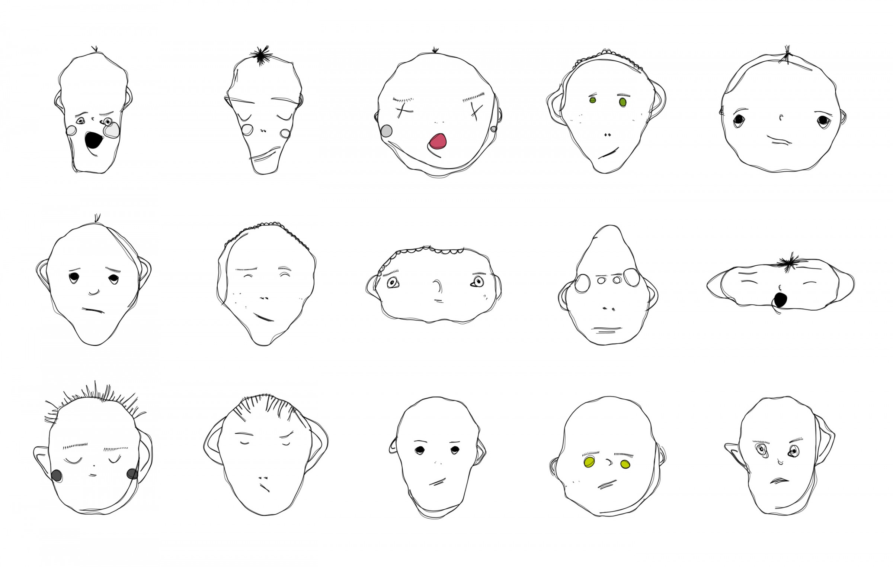

# Face Perception (Computers)

nice intro image

nice intro paragraph

---

### How the algorithms work

#### Datasets

#### Recognition

Face Recognition in Corneal Reflections

#### Tracking

---

### What the algorithms give you

#### Vertices

#### Orientation (Position/Rotation)

#### Expression

#### Identity

---

### Works:

Lauren McCarthy & Kyle McDonald, [How We Act Together](https://hwat.schirn.de/)

--

Zach Lieberman & R. Luke Dubois, [Face Values](https://www.instagram.com/p/BnUYy-2gSO3/) (2018)

--

Adam Harvey, [MegaPixels: Faces](https://ahprojects.com/megapixels-glassroom/) (2017)

--

Andy Clymer [font-face](https://vimeo.com/26188365) (2012)

--

[Google Arts & Culture App](https://itunes.apple.com/us/app/google-arts-culture/id1050970557?mt=8) (2017)

--

[Nvidia AI-Generated Human Faces](https://arxiv.org/pdf/1812.04948.pdf) (2018)

--

Memo Atken, [Optimizing for Beauty](http://www.memo.tv/portfolio/optimising-for-beauty/) (2017)

--

Ziv Schneider, [Facing the Nameless](https://zivschneider.com/Facing-the-Nameless) (2015)

--

Heather Dewey-Hagborg, [Stranger Visions](http://deweyhagborg.com/projects/stranger-visions) (2011)

--

Matthias Dorfelt, [Weird Faces](https://www.mokafolio.de/works/Weird-Faces) (2012)

--

Adam Harvey, [CVDazzle](https://cvdazzle.com/) (2010)

--

Jill Magid, [Evidence Locker](http://www.jillmagid.com/projects/evidence-locker-2) (2004)

--

Kyle McDonald, [People Staring At Computers](https://vimeo.com/25958231) (2011) ([follow-up](https://www.wired.com/2012/07/people-staring-at-computers/))

--

Jon Rafman, [9 Eyes](http://9-eyes.com/) (2009)

