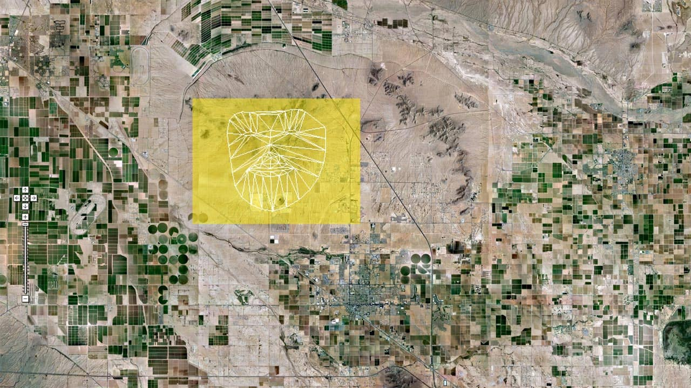

# Face Perception (Humans)

nice intro image

nice intro paragraph

---

## The science of studying faces

#### Techniques

#### Findings

---

## Reading a face (Expressions)

#### Models

#### Context

### Works:

Andy Warhol, [Screen Tests](https://www.youtube.com/watch?v=hLW_sXv44Uc) (1960s)

--

Bill Viola, [The Passions](https://www.youtube.com/watch?v=MR9av-I35ME)

--

Sam Taylor-Wood, [Hysteria](https://www.youtube.com/watch?v=33PZhpay8gM)

--

Nacho Guzman, [Sparkles and Wine](https://vimeo.com/63602119)

--

Phillip Toledano, [Gamers](http://mrtoledano.com/photo/gamers/thumbnails/)

---

## Knowing a face (Identity & Recognition)

#### Face Transformations

#### Caricature

#### Face Blindness (Prosopagnosia)

#### Pareidolia

### Works

Nobumichi Asai, [INORI (Prayer)](https://vimeo.com/210599507) (2017)

Nobumichi Asai, [OMOTE](https://vimeo.com/210599507) (2014)

--

Greg Borenstein, [Machine Pareidolia](http://urbanhonking.com/ideasfordozens/2012/01/14/machine-pareidolia-hello-little-fella-meets-facetracker/) (2012)

--

onformative, [Google Faces](https://onformative.com/work/google-faces?p=lab/googlefaces/) (2013)

--

Shinseungback Kimyonghun, [Cloud Face](http://ssbkyh.com/works/cloud_face/)

--

---

## Judging a face (Social Categories & Stereotypes)

#### Age

#### Gender

#### Attractiveness

### Works

Nancy Burson, [Guys Who Look Like Jesus](http://nancyburson.com/guys-who-look-like-jesuswomen-who-look-like-mary/)  (also [Composites](http://nancyburson.com/composite-silver-prints/), [Happier Icons](https://www.youtube.com/watch?v=eYtwWuv7gP8), and [Human Race Machine](http://www.humanracemachine.com/))

--

Jason Salavon, [Every Playboy Centerfold](http://salavon.com/work/EveryPlayboyCenterfoldDecades/) (2002) (also [100 Special Moments](http://salavon.com/work/SpecialMoments/), and [Portrait](http://www.salavon.com/work/Portrait/))

--

Rollin Leonard, [Crash Kiss](http://rollinleonard.com/2016/Crash%20Kiss%20Kate%20Rollin%20animation/) (2013) ([another video](https://vimeo.com/81549999))

--

Wonjun Jeong, [Conversation](https://www.behance.net/gallery/46353479/Conversation) (2016)

--

Scatter NYC, [Clouds](http://scatter.nyc/clouds/) (2014)

--

Lorna Barnshaw, [Reality Reduction](https://www.behance.net/gallery/8137337/Reality-Reduction) (2013)

--

Mike Pelletier, [Kinect Portraits](http://mikepelletier.net/Kinect-Portraits-1) (2013)

--

Evan Baden, [The Illuminati](http://evanbaden.com/the-illuminati-%E2%80%93-200607.html) (2006)

