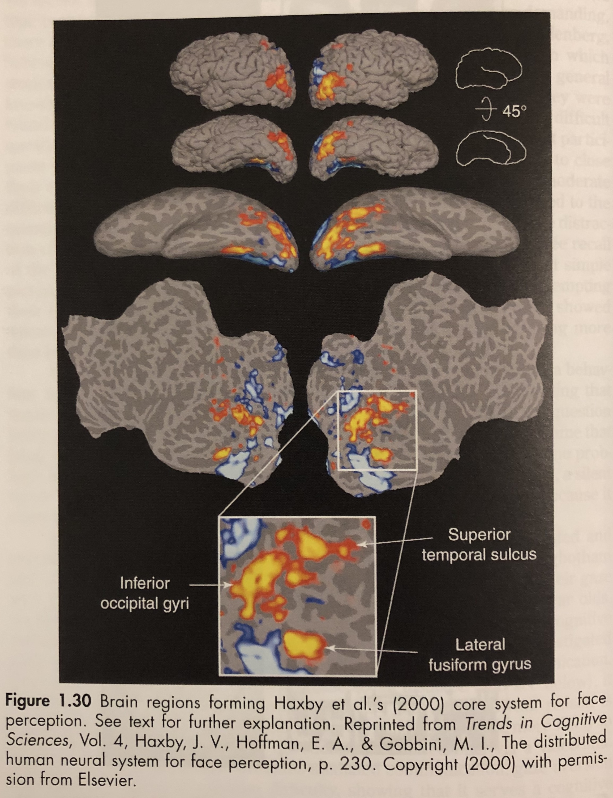
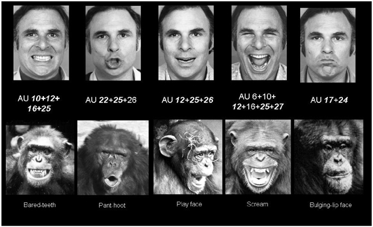
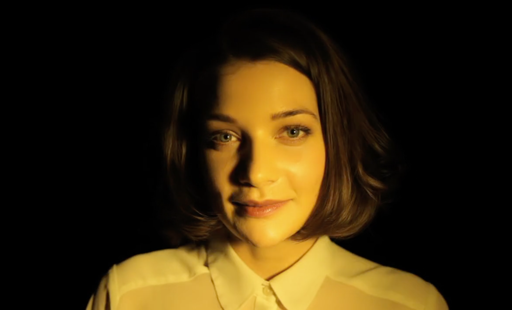
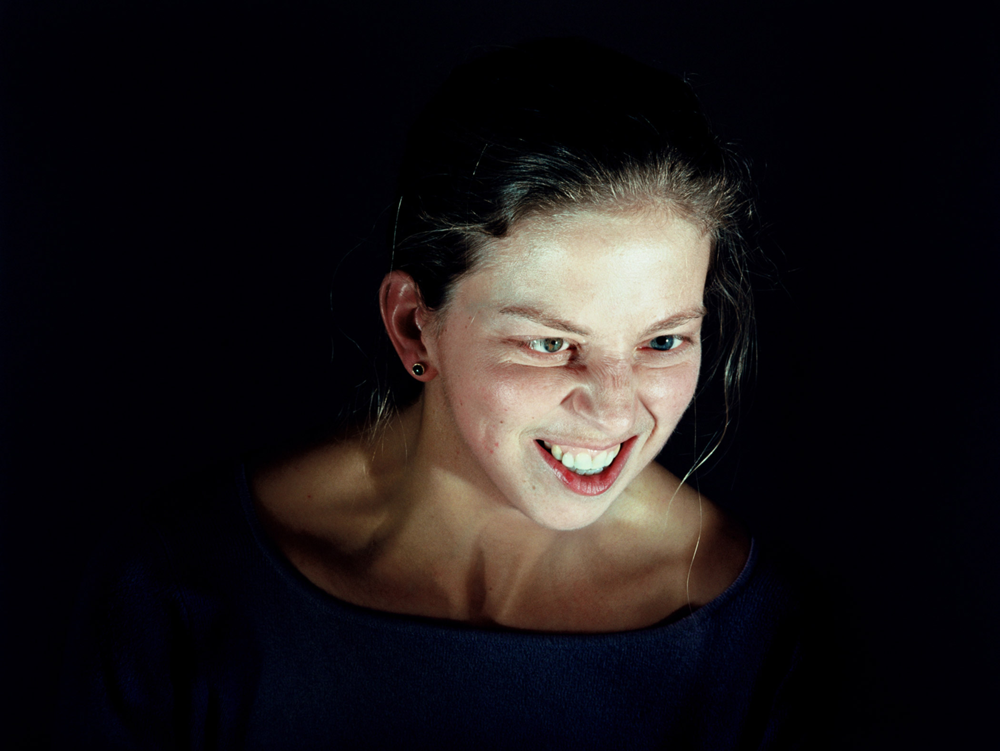

# Face Perception (Humans)

Here we'll look at some research that's gone into how people percieve faces and tie it to some contemporary art pieces that take play with the science.

---

## The science of studying faces

The scientific study of faces exists somewhere in the intersection of psychology, anthropology, and neurology.

A _ton_ of psychological studies involve showing people faces and seeing how their brains respond.

These studies look at the border of where we do and don't see a face:

They make tweaks to facial features to see what's disturbing to us about a particular face or when we stop recognizing the person in the image:

And they try to locate the borders of our social judgements - how we decide on a person's gender, identity, or attractiveness.

These studies have yielded a _tremendous_ amount of interesting things, and I'll just cover a few of them here.

The first is that a part of our brains has specifically evolved to process and interpret faces. Within your [occiptal lobe](https://en.wikipedia.org/wiki/Occipital_lobe), which is in the back left of your brain and deals with visual processing, there is a region called the [inferior occipital gyrus](http://braininfo.rprc.washington.edu/centraldirectory.aspx?ID=156). This is the first thing in your brain to light up when you see a face.

Scientists have studied this region so extensively that they've basically agreed on a functional model for how your brain interprets all the pieces of a face.

The key thing here is that different regions of your brain process expression and identity, and those processes happen in parallel.

Next time a billboard with a face on it flashes past you, try to figure out what information you've extracted. Maybe you know the face was happy or sad, but you have no idea what the person actually looked like.

There are really interesting parallels in how computers have been built to process facial images, especially around the division of labor in different processing tasks. We'll get into those later, but keep them in mind.

---

## Reading a face (Expressions)

In 1872, eleven years after the release of _On the Origin of Species_, Charles Darwin published a book about facial expressions, called [_The Expression of the Emotions in Man and Animals_](https://en.wikipedia.org/wiki/The_Expression_of_the_Emotions_in_Man_and_Animals). It was one of the first scientific studies to look at the evolutionary and biological role of faces.

Darwin concluded that human facial expressions were basically universal. He outlined six emotions (joy, anger, sadness, disgust, surprise, and fear) which express themselves in the same pattern of facial muscle movements across every human culture.

This 'universality thesis' has [since been challenged](https://www.affective-science.org/pubs/2018/gendron-et-al-universality-cdps.pdf), but is more or less accepted among biologists and anthropologists.

The most significant contributor to facial expression research since Darwin is probably [Paul Ekman](https://en.wikipedia.org/wiki/Paul_Ekman), who invented the [Facial Action Coding System](http://www.cs.cmu.edu/afs/cs/project/face/www/facs.htm) (FACS).

Ekman wanted to break down facial expressions into component parts beyond the six major emotions. FACS was his attempt to map facial muscle movements to corresponding expressions.

Many other systems for categorizing emotional expression have popped up over the years. Perhaps the main overlapping characteristic between them is the treatment of expression as a spectrum, where faces can exist along multi-dimensional axes.

This will pop up again as we look at how computers interpret facial expression, and you might see it from time to time in pop culture, too.

It's important to note that humans use more than a face to interpret a person's emotionality.

Contextual information and audio-visual cues (voice, tone, inflection) are just as important to making an accurate judgement about emotional state.

Researchers have uncovered many contextual 'shortcuts' that people use to judge one another's emotional state. Eyes are particularly important. The following image illustrates how much information we as humans can draw from eye contrast and shape.

### Works:

Andy Warhol, [Screen Tests](https://www.youtube.com/watch?v=hLW_sXv44Uc) (1960s)

--

Bill Viola, [The Passions](https://www.youtube.com/watch?v=MR9av-I35ME)

--

Sam Taylor-Wood, [Hysteria](https://www.youtube.com/watch?v=33PZhpay8gM)

--

Nacho Guzman, [Sparkles and Wine](https://vimeo.com/63602119)

--

Phillip Toledano, [Gamers](http://mrtoledano.com/photo/gamers/thumbnails/)

---

## Knowing a face (Identity & Recognition)

A lot of facial research has gone into what cues we use to determine if we know a person or not.

Flipping a face upside down makes it particularly hard to recognize.

Same with the displacement of individual features. Can you know a person only from an image of their nose? Their eyes?

Lots of research points to the face that what makes a face recognizable really differs from face to face. Somehow, our brains are reducing the information used to recognize a person into a format which emphasizes their face's particular 'abnormalities'.

The art of caricature is a particularly controlled type of face transformation, where these abnormalities are either emphasized or reduced.

Computers have proved somewhat bad at caricature - you won't find too many successful 'caricature filters' where somebody with a large nose has that nose emphasized.

The flip side of caricature is a disability known as face blindess, or prognopagosia, where a person's ability to recognize faces is greatly diminished.

[Oliver Sacks](https://en.wikipedia.org/wiki/Oliver_Sacks) was a neurologist and writer who both documented prognopagosia (see his famous book [_The Man Who Mistook His Wife for a Hat_](https://en.wikipedia.org/wiki/Oliver_Sacks)) and suffered from it himself.

[Here's an excellent video](https://www.youtube.com/watch?v=k5bvnXYIQG8) of Sacks explaining his experiences with the disorder:

Another inversion of the ability to recognize faces is the world of pareidolia, where we detect faces in inanimate objects or images.

I would definitely recommend getting lost in the [Flickr 'pareidolia' tag](https://www.flickr.com/photos/tags/pareidolia/) or exploring [the pareidolia subreddit](https://www.reddit.com/r/Pareidolia/).

### Works

Nobumichi Asai, [INORI (Prayer)](https://vimeo.com/210599507) (2017)

Nobumichi Asai, [OMOTE](https://vimeo.com/210599507) (2014)

--

Greg Borenstein, [Machine Pareidolia](http://urbanhonking.com/ideasfordozens/2012/01/14/machine-pareidolia-hello-little-fella-meets-facetracker/) (2012)

--

onformative, [Google Faces](https://onformative.com/work/google-faces?p=lab/googlefaces/) (2013)

--

Shinseungback Kimyonghun, [Cloud Face](http://ssbkyh.com/works/cloud_face/)

---

## Judging a face (Social Categories & Stereotypes)

Many facial studies have explored how we make judgements about different social categories, such as age, race, gender, attractiveness, and trustworthiness.

Based on cues and responses, scientists have been able to model different spectrum for these categories.

The following image, for example, is a photo that emphasizes the cues we use to make a determination about somebody's age:

We can now easily process image to make a person appear older or younger:

It actually turns out this happens in totally predictable ways. In fact, your face develops really similarly to an apple:

And [here's a totally fascinating video](https://www.youtube.com/watch?v=wFY_KPFS3LA) of how an embryo's face develops inside the womb.

Along with age, a lot of research has gone into the perception of gender in faces.

The following image shows exactly the same face, only with slightly different coloring. Do you see either one as a particular gender?

We perceive huge differences in gender from _tiny_ cues. Look at the image below. Each face has been altered to be either more or less feminine/masculine, but you'd be hard pressed to spot individual differences.

A final category of study is attractiveness.

Paradoxically, humans find 'averaged' faces to be more and more attractive based on the number of faces that have gone into the averaging. The image below shows some of these composite faces. The number of faces used to make the composite increases as you move down the image.

Here are some images generated by averaging faces from different countries. There's a generic attractiveness that I find really interesting.

### Works

Nancy Burson, [Guys Who Look Like Jesus](http://nancyburson.com/guys-who-look-like-jesuswomen-who-look-like-mary/)  (also [Composites](http://nancyburson.com/composite-silver-prints/), [Happier Icons](https://www.youtube.com/watch?v=eYtwWuv7gP8), and [Human Race Machine](http://www.humanracemachine.com/))

--

Jason Salavon, [Every Playboy Centerfold](http://salavon.com/work/EveryPlayboyCenterfoldDecades/) (2002) (also [100 Special Moments](http://salavon.com/work/SpecialMoments/), and [Portrait](http://www.salavon.com/work/Portrait/))

--

Rollin Leonard, [Crash Kiss](http://rollinleonard.com/2016/Crash%20Kiss%20Kate%20Rollin%20animation/) (2013) ([another video](https://vimeo.com/81549999))

--

Wonjun Jeong, [Conversation](https://www.behance.net/gallery/46353479/Conversation) (2016)

--

Scatter NYC, [Clouds](http://scatter.nyc/clouds/) (2014)

--

Lorna Barnshaw, [Reality Reduction](https://www.behance.net/gallery/8137337/Reality-Reduction) (2013)

--

Mike Pelletier, [Kinect Portraits](http://mikepelletier.net/Kinect-Portraits-1) (2013)

--

Evan Baden, [The Illuminati](http://evanbaden.com/the-illuminati-%E2%80%93-200607.html) (2006)

